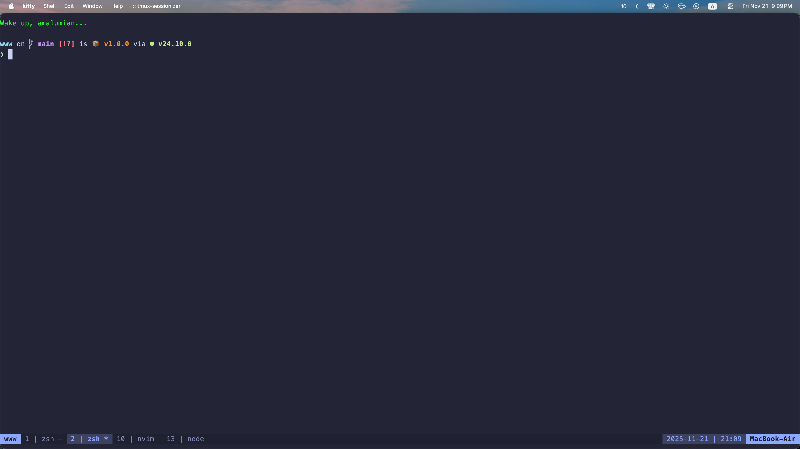
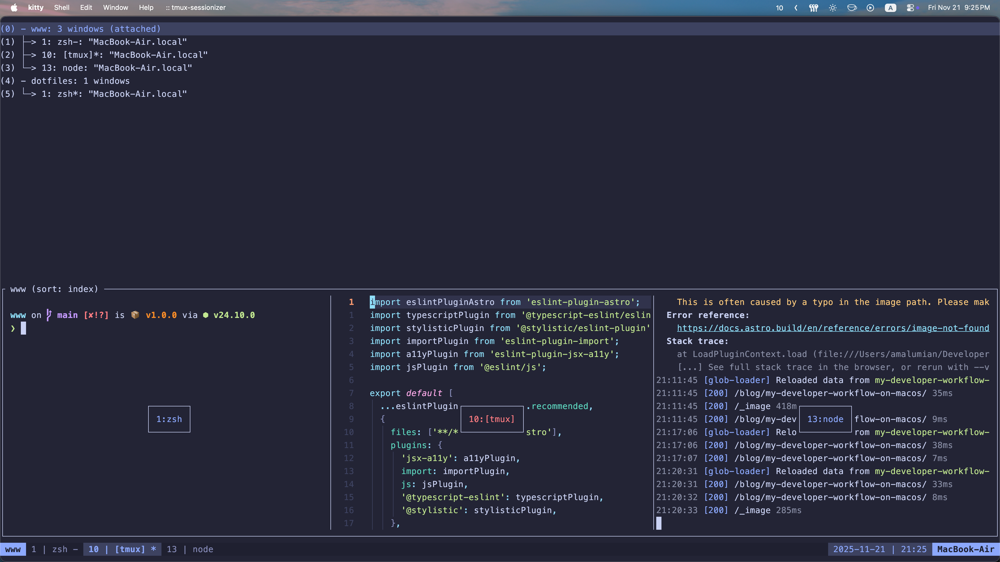
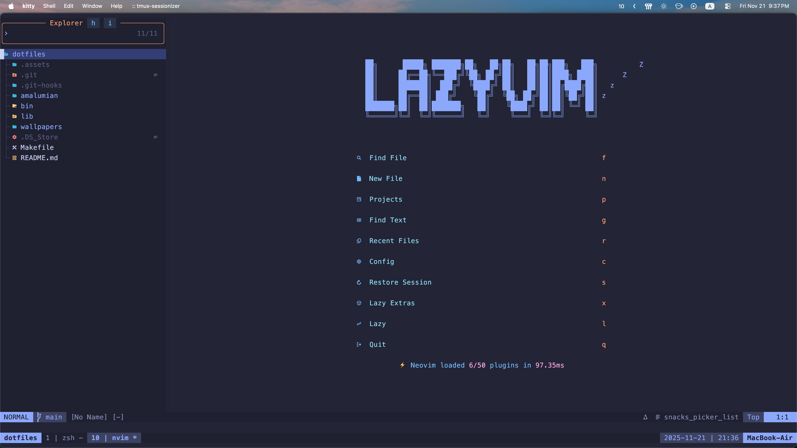

_Update 11/21/2025_

In this post, I'll share what I believe to be the most productive way to develop applications on macOS. Before we get started, you can find my [dotfiles](https://github.com/amalumian/dotfiles) on GitHub.

## Prerequirements


The only essential requirement to achieve the same level of efficiency is touch typing. In my experience, you need to reach a typing speed of around 60 words per minute to feel completely comfortable.

There are many services to learn this skill, but my favorite — and the one I personally used — is [Ratatype](https://www.ratatype.com).

I highly recommend doing some key remapping. I use [Karabiner-Elements](https://github.com/pqrs-org/Karabiner-Elements) for this. First, remap `Caps Lock` to `Control` or get yourself a split keyboard. It’s one of the most frequently used modifier keys, but its default position is pretty uncomfortable. You’ll thank yourself later.

Another useful thing I’ve done with Karabiner is setting up a `Hyper Key`. A `Hyper Key` is a single key mapped to all four modifier keys at once: `Control`, `Option`, `Command`, and `Shift`. This makes it easy to assign custom shortcuts without conflicts. I use it for all of my [AeroSpace](https://github.com/nikitabobko/AeroSpace) shortcuts.

## Window Manager

import Video from '@/components/Video.astro';

<Video src='/videos/blog/my-developer-workflow-on-macos/aerospace.mp4 ' />

[AeroSpace](https://github.com/nikitabobko/AeroSpace) is an i3-like tiling window manager for macOS. It's the best window manager I've found for macOS. It provides unlimited virtual workspaces and navigation between them, flexible window management, and plenty of other useful features.

I like the idea of mapping specific workspaces to applications or particular workflows. Here’s how I’ve organized mine:

1. Browser (Personal)
2. Browser (Work)
3. Work Apps (Figma / DBeaver / Postman)
4. Notes
5. Messenger
6. Music
7. Empty
8. Empty
9. Mail/Calendar/Reminders
10. Terminal

Another convenient feature you can configure is automatically moving an app to a specific workspace when it launches. That’s how I have all my apps set up.

For example, I configured opening the terminal i3-style with `Hyper` + `Enter`, and once it launches, it’s automatically moved to workspace 10. If I’m on another workspace and press `Hyper` + `Enter`, instead of opening a new terminal window, AeroSpace simply focuses the already-opened one.

I also recommend changing the shortcuts to Vim-style `hjkl` for better efficiency.

## Terminal



I use [kitty](https://github.com/kovidgoyal/kitty), a lightweight and highly configurable terminal. Before that, I used iTerm2, but I didn’t really like configuring it through the GUI, and it felt heavier. However, iTerm2 did render colors and fonts a bit better.

### tmux



[tmux](https://github.com/tmux/tmux) is a terminal multiplexer — it probably needs no introduction. One small tweak I highly recommend is changing the default window index from 0 to 1. Since the number keys on the keyboard start at 1, it just feels more intuitive. I also suggest remapping the pane navigation shortcuts to Vim-style `hjkl`.

What really takes productivity to the next level is pairing tmux with [tmux-sessionizer](https://github.com/ThePrimeagen/tmux-sessionizer). This simple yet powerful tool lets you quickly switch between predefined tmux sessions for different projects. At work, I often handle three repositories simultaneously, and tmux-sessionizer makes it seamless. It’s incredibly convenient and saves a lot of mental overhead.

### Neovim



Vim is the best text editor, and [Neovim](https://github.com/neovim/neovim) takes it even further. It provides one of the most efficient and comfortable ways to work with text.

You can either configure Neovim yourself or use a pre-configured setup like [LazyVim](https://www.lazyvim.org/). I ended up choosing LazyVim and even wrote a [post](https://www.malumian.dev/blog/i-switched-to-lazyvim/) about why.

If you want to get started with Neovim, begin by learning the basic Vim motions. A good first step is to install a Vim plugin in your current code editor, whether it’s WebStorm, VS Code, or something else — it doesn’t matter. Just get comfortable with the Vim motions. Once you feel confident, move on to the full Neovim experience in the terminal.

### mise

```toml
[tools]
lua = "5.1"
node = "latest"
rust = "latest"
go = "latest"
python = "latest"
ruby = "latest"
clojure = "latest"
haskell = "9.4.8"
```

For managing different versions of programming languages, I use [mise](https://github.com/jdx/mise). It lets you install all the necessary languages with a single command: `mise install`. Additionally, you can configure a specific version of a language to be used for a particular project.
