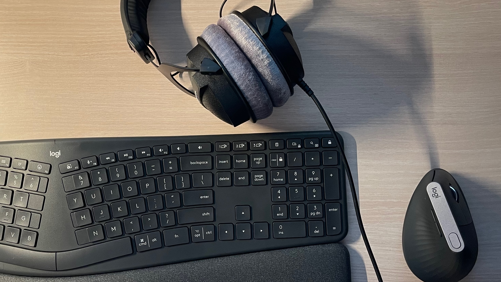

It seems like I've finally stopped… stopped searching for computer peripherals. Over the past four years, since I decided to become a software engineer, I've been chasing those "perfect" tools for my craft. And, spoiler, the final choice turned out to be quite boring.

I started with the usual Apple gear: Apple Magic Keyboard and Apple Magic Mouse. The keyboard choice was straightforward. I wanted something identical to my laptop keyboard, just external. Magic Keyboard fit that perfectly. In the world of membrane keyboards, I'd say it's close to ideal.

The same can't be said about the mouse. Within a couple of months, Apple Magic Mouse was replaced with a Logitech Signature M650, and later with the Apple Magic Trackpad.

I think this Apple setup (Magic Keyboard and Magic Trackpad) could have worked for me for years, but then I got a remote job and my office moved home. I needed a way to quickly switch peripherals between two laptops, and Apple devices aren't great at that. At the same time, I started thinking about trying a mechanical keyboard. So I ended up searching again.

I liked the look of the Nuphy Air V2 keyboard, and among mice there was a clear leader — Logitech MX Master 3S. Both devices are built with high-quality materials, support multiple devices, and overall it felt like I could finally stop there. But no.

At some point, I started thinking about ergonomics and the impact of devices on health, so I rebuilt my setup once again. Among keyboards, I liked the Kinesis Advantage360 Professional the most. I can't afford it yet, but it's probably the best keyboard I've seen. I planned to buy it this year, but decided against it for now — $500 doesn't feel very practical at the moment.

In the end, I settled on Logitech's ergonomic lineup: the Logitech Ergo Keyboard and the Logitech MX Vertical. For their price, they offer a very strong combination of quality and ergonomics.

That said, compared to the Logitech MX Master 3S, the Vertical falls short in terms of materials and technology. But in terms of grip, it's noticeably more comfortable for me, and that ultimately mattered more.

Before the Logitech Ergo Keyboard, I also tried a Corne split keyboard from AliExpress. It's actually a decent option, but it didn't fit my layout. I need modifiers like `shift`, `ctrl`, `opt`, `left cmd`, and `right cmd` (which I use as a `hyper key`) on the main layer, and I couldn't place them in a way that felt right.

I think I'll stick with this setup for the next few years. It's not perfect, but it feels like I've finally stopped chasing perfection and just picked tools that are comfortable to use.

